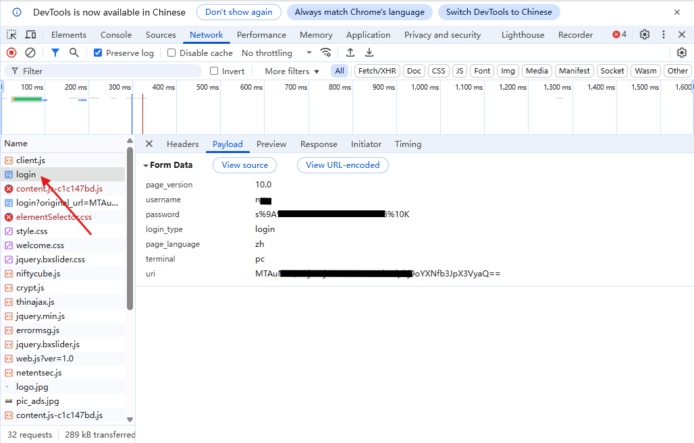
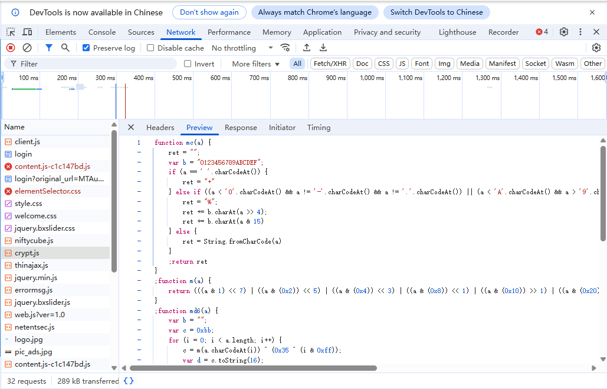
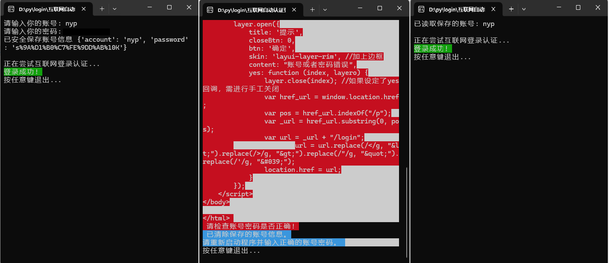
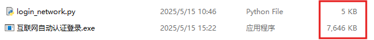

## 前言

`公司使用互联网每天最头疼的事莫过于联网还得登录。作为一个懒人，如此的重复劳动属实是不能接受的。为了解决这个问题，想着部署单点登录无奈推进坎坷。没办法先搞个web联网认证自动脚本吧。`

## Web登录页面分析

第一步就是得弄明白报文的地址和格式，然后只需要让代码替代请求即可完成。使用Chrome浏览器打开认证登陆界面按下<kbd>F12</kbd>打开网络解析器，勾选<kbd>Preverse log</kbd>选项。输入账号密码登录，对登录请求进行分析。可以看到，我们按下登录按钮后，网络请求资源中有一个**login**登录请求。我们点击它，详细信息在右边显示，包括请求头、返回头、payload、cookies等信息。我们最关注的是payload里提交的信息，这里记录我们的账号密码等信息，点击查看一下：



这里payload的表单信息包括页面版本、登陆账号、登录密码、语言等信息。但，这个password这么一长串，也不是我输入的密码啊？这是森马加密方法呢？有点难搞。我来尝试重新登录下。哎，密文没有变。好好好分析下从登陆界面开始到登陆成功为止，很明显是从**login**先开始的，这里的密码已经加密了。在这之前我也没输入过密码。所以，”心机之蛙，一直摸你肚子“，密码是在前端直接加密了！是在我按下登陆的同时前端实时加密然后再上传的。

这不So easy， JS代码里肯定有加密代码。

妈蛋，还分析个6啊请求资源列表里这不摆着**crypt.js**加密嘛。我这眼镜白带了。那么好我们来打开看下：


是个Md6？哈希密码？不管了有了方法就好办了。

## PyCharm启动（写脚本）

二半吊子写py，过程极其坎坷直接上完整代码：

```python
# -*- coding: utf-8 -*-
# @Author  : N10
# @Email   : dp7100@126.com
# @Software: PyCharm

import msvcrt
import requests
import json
import os

# 使cmd能够正确输出颜色
if os.name == "nt":
    os.system("")

# 切换工作目录到系统临时文件区域
os.chdir(os.getenv('TMP'))
# 文件名称
file_name = "user_account.json"


# md6加密函数 - 根据前端crypt.js实现
def md6(s: str) -> str:
    """完全匹配前端crypt.js的md6函数实现"""

    def mc(a: int) -> str:
        a = a & 0xFF  # 确保a是无符号8位整数
        b = "0123456789ABCDEF"
        if a == ord(' '):
            return '+'
        elif (a < ord('0') and a != ord('-') and a != ord('.')) or \
                (a < ord('A') and a > ord('9')) or \
                (a > ord('Z') and a < ord('a') and a != ord('_')) or \
                (a > ord('z')):
            return f"%{b[(a >> 4) & 0xF]}{b[a & 0xF]}"
        else:
            return chr(a)

    def m(a: int) -> int:
        return (
                ((a & 1) << 7) |
                ((a & 0x2) << 5) |
                ((a & 0x4) << 3) |
                ((a & 0x8) << 1) |
                ((a & 0x10) >> 1) |
                ((a & 0x20) >> 3) |
                ((a & 0x40) >> 5) |
                ((a & 0x80) >> 7)
        ) & 0xFF  # 确保结果在0-255范围内

    result = ""
    c = 0xbb
    for i in range(len(s)):
        a = ord(s[i])
        ma = m(a)
        mask = i & 0xff
        xor = 0x35 ^ mask
        c = (ma ^ xor) & 0xFF  # 关键：确保c是无符号8位整数
        result += mc(c)
    return result


# 检查是否需要输入账号密码，如果不存在临时文件，根据输入新建临时文件保存账号密码。
if not os.path.exists(file_name):
    # 输入账号密码
    account = input("请输入你的账号: ")
    password = input("请输入你的密码: ")

    # 对密码进行哈希处理
    hashed_password = md6(password)

    # 保存账号和哈希后的密码
    res = {
        'account': account,
        'password': hashed_password
    }
    print("已安全保存账号信息", res)
    # 写入json
    with open(file_name, "w+") as fp:
        fp.write(json.dumps(res))
# 如果存在，说明之前已经写入
else:
    # 读取账号和哈希后的密码
    with open(file_name, "r") as fp:
        res = json.loads(fp.read())
        account = res['account']
        hashed_password = res['password']  # 明确这是哈希后的密码
        print(f"已读取保存的账号: {account}")

# 请求网址
url = "http://10.1.1.10/login" #认证页面地址。
# 请求头
headers = {
    "X-Requested-With": "XMLHttpRequest",
    "User-Agent": "Mozilla/5.0 (Windows NT 10.0; Win64; x64) AppleWebKit/537.36 (KHTML, like Gecko) Chrome/97.0.4692.71 Safari/537.36",
    "Content-Type": "application/x-www-form-urlencoded; charset=UTF-8", # 必须指定，否则报404
}

print("\n正在尝试互联网登录认证...")

while True:
    try:
        # 直接使用从文件中读取的哈希值
        encrypted_pwd = hashed_password

        # 打印发送的加密密码（调试用）
        # print(f"发送的加密密码: {encrypted_pwd}")

        # 构建登录请求参数
        payload = f"page_version=10.0&username={account}&password={encrypted_pwd}&login_type=login&page_language=zh&terminal=pc&uri=换成你的uri地址"

        # 发送登录请求
        res = requests.post(url, data=payload, headers=headers)

        # 打印响应内容（调试用）
        # print(f"响应状态码: {res.status_code}")
        # print(f"响应内容: {res.text}\n")

        # 判断登录是否成功
        failed_keywords = ["登录失败", "error", "账号或密码错误", "认证失败", "账号或者密码错误"]
        success_keywords = ["success", "欢迎", "认证成功", "登录成功"]

        has_failed = any(keyword in res.text for keyword in failed_keywords)
        has_success = any(keyword in res.text for keyword in success_keywords)

        is_success = res.status_code == 200 and (has_success or "location.href" in res.text) and not has_failed

        if is_success:
            print(f"\033[7;32;47m登录成功! \033[0m")
        else:
            print(f"\033[7;31;47m登录失败! {res.content.decode('utf-8')} \033[0m")
            print("\033[7;31;47m", "请检查账号密码是否正确!", "\033[0m")
            os.remove(file_name)
            print("\033[7;36;47m", "已清除保存的账号信息。\n请重新启动程序并输入正确的账号密码。", "\033[0m")

        print("按任意键退出...")
        if ord(msvcrt.getch()):
            break
    except Exception as err:
        print("\033[7;31;47m", "登录错误！\t可能需要先连接WiFi？", "\033[0m")
        print("\033[7;33;40m", f"错误详情: {err}", "\033[0m")
        print("按 'R' 键重新尝试，或按任意键退出...")
        if ord(msvcrt.getch()) != 114:
            break
```

> 脚本避免明文存储密码采用先哈希加密后保存到json的方式进行登录认证。

在第一执行脚本时会在win临时目录下创建**user_account.json**文件来存储用户的用户名和加密后的密码信息。如果通过认证第二次执行脚本时会直接调取存储的信息。否则会删除json文件重新输入信息。运行结果如图：



##  开机自动运行

###  1.Windows系统

在windows下有一个自启动文件夹：

```
C:\Users\你的用户名称\AppData\Roaming\Microsoft\Windows\Start Menu\Programs\Startup
```

这个文件夹里放置的所有windows可识别文件都会在开机时自动执行。下面我们就使用这个文件夹进行部署。

####  1).py文件直接部署

这是最简单的部署方法，前提电脑有python编译器支持。用bat批处理调用python编译器执行脚本：

```bash
start python /“文件目录”/login_network.py
```

然后把bat文件放在前面说的**Startup**文件夹下即可。

####  2).EXE部署

为了让没有python编译器也可以在任意windows系统运行。我们把py脚本打包成EXE可执行程序。但因为打包了python编译器，导致一个简单的脚本也需要很多mb的空间占用。

首先python安装nuitka模块。

```bash
pip install -U nuitka
```

> #### Nuitka是什么？
>
> nuitka是一个用来将python代码打包为exe可执行文件，方便其在没有相关环境的windows系统上运行的工具。其原理为：将python代码（自己写的部分）转换成C代码，以提高运行的速度。

打包login_network.py为exe

```
nuitka --onefile --include-package=requests --remove-output --assume-yes-for-downloads --output-filename=互联网自动认证登录.exe login_network.py
```

> 参数说明：
> --onefile    打包为单个exe文件
>
> --include-package=requests	指定 requests 插件，确保 requests 库被正确打包
>
> --remove-output    移除临时文件，减小最终文件大小
>
> --assume-yes-for-downloads	自动下载缺少的依赖
>
> --output-filename=互联网自动认证登录.exe  打包完成后，会在当前目录生成`互联网自动认证登录.exe`文件

可以看到我们用nuitka输出的exe文件。文件大小还是有点大的，本来5kb的代码打了个包变成了7.6Mb。



打包完我们将代码放到自启动目录。无需其它操作，开机即可自行启动运行。
